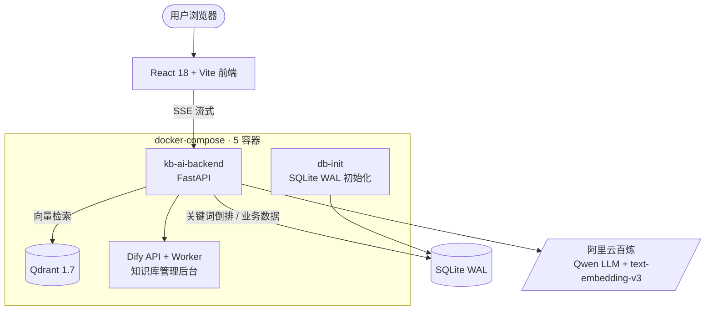

# KB-AI · 便携式本地 AI 知识库

> **一句话定位**:跑在 USB 移动硬盘上的**本地化、低依赖、单用户** AI 知识库 —— 插上电脑双击 `start.bat` 即可用,数据全部留在本地,不依赖任何云端存储。
>
> 为一位**非技术用户**(餐饮分公司总经理)真实交付并日常使用;Windows / macOS 双平台支持。**当前版本**:见根目录 `version` 文件(v1.7.0)。

---

## 为什么做这个

市面上的知识库产品要么强绑定云端、要么部署门槛高。KB-AI 的取舍是:**把复杂度压进工程,把简单留给用户** —— 非技术用户插上 U 盘双击就能用。整套系统只有 5 个 Docker 容器 + 一个 FastAPI 后端 + 一个 React 前端,LLM 能力走阿里云百炼 API,检索与数据全部留在本地。

---

## 核心特性

- 💬 **Chat-first 对话**:自建 React 前端 + FastAPI SSE 流式回答,脚注引用知识库来源
- 🤖 **工具调用 Agent(v2.0)**:多步问题自主拆解为「检索 → 计算 → 作答」工具链,4 个只读工具(kb_search / calculator / get_current_time / web_search),前端步骤面板实时展示每一步工具调用,轨迹落库可审计
- 🔍 **混合检索**:Qdrant 向量 + SQLite 关键词倒排,RRF 融合 + Cross-Encoder 重排 + 时间加权
- 📄 **文档解析**:MinerU 解析 PDF/Office,`.docx`/`.xlsx` 有 pandoc/openpyxl 兜底
- 🧠 **双模型路由**:默认 Qwen-Plus,复杂问题自动切 Qwen-Max,L0→L3 失败互切降级(用户无感知)
- 🖼️ **多模态**:图片理解(Qwen-VL 描述入库)
- 🔌 **可携带**:全部数据(`data/` + `vectors/`)在移动硬盘;`stop.bat` 自动备份到电脑硬盘(保留 7 份)
- 🩺 **自诊断**:`health-full.ps1` 一屏健康度、`disk-alert.ps1` 容量 5 级告警、`/api/debug/retrieval` 检索全链路调试
- 💰 **成本工程**:`cost-alert.ps1` 月度配额 rollup,超阈值自动阻断付费调用(含 Agent 多步放大成本)

## 架构



| 端口 | 用途 |
|---|---|
| **8000** | 主入口:自建前端 + FastAPI API |
| 8080 | Dify Web UI(知识库管理后台,保留兼容) |
| 6333 | Qdrant(仅绑 127.0.0.1) |

## 工程指标(实测)

| 指标 | 数值 |
|---|---|
| 后端单元测试 | **353** 个(pytest,41 个测试文件) |
| 前端测试 | **18** 个(vitest) |
| RAG 评测集 | **50** 条 golden-QA(检索回归) |
| Agent 评测集 | **23** 条 golden-agent(工具选择 + 任务完成) |
| API 端点 | **39** 个(12 个路由模块) |
| Agent 工具 | **4** 个只读工具(kb_search / calculator / get_current_time / web_search) |
| 容器编排 | **5** 容器 docker-compose |
| 平台支持 | Windows(`.bat`/`.ps1`)+ macOS(`.command`)双平台 |

> 另有多组 PowerShell mock 回归脚本(`tests/test_*.ps1`),无需 Docker 即可跑核心链路冒烟。

## 设计决策

- **便携优先**:全部运行时数据在移动硬盘,代码仓库与数据分离;`stop.bat` 负责停服务 + SQLite 落盘 + 自动备份,拔盘前一键完成。
- **低依赖**:不引入重型框架;后端仅 FastAPI + 少量核心库,检索/重排/降级/Agent 循环全部自研(见 `docs/adr/0002-agent-loop-self-built.md`),链路每一环可调试、可测试。
- **降级哲学**:双模型 L0→L3 路由(默认模型失败自动互切),检索有 RRF 融合兜底,解析有 pandoc/openpyxl 兜底,Agent 工具失败转 error observation 续跑 —— 任何单点失效用户都不感知。
- **评测驱动**:50 条 golden-QA(检索)+ 23 条 golden-agent(工具选择/任务完成)双评测集,质量改动必须有回归数据支撑。
- **成本工程**:调用量按日聚合落库,月度配额超阈值自动阻断付费路径(Agent 多步循环有 max_steps 硬顶 + 预算耗尽收尾),防止非技术用户产生意外账单。

## 快速开始

```bat
1. 插入移动硬盘
2. 双击 start.bat        (首次 3-5 分钟加载预置文件,之后 30-60 秒)
3. 浏览器打开 http://localhost:8000
```

拔盘前**必须**双击 `stop.bat`(停服务 + SQLite 落盘 + 自动备份)。
新用户详见 **[QUICKSTART.md](QUICKSTART.md)**(非技术用户向,5 分钟上手)。

### Agent 模式(可选)

设置页「对话模式」打开 **Agent 模式**开关后,多步问题由 Agent 自主拆解:例如「对比去年和今年的会员储值,算出增长率」会依次触发 `kb_search`(检索两次)→ `calculator`(算增长率)→ 作答,每一步工具调用实时显示在回答上方的步骤面板,轨迹存 `agent_runs`/`agent_steps` 表可审计(`GET /api/agent/runs`)。默认关闭,与标准问答双链路并存,可对比效果。

### 作为 MCP Server 使用(可选)

KB-AI 的 `kb_search` 检索能力可暴露为标准 **MCP(Model Context Protocol)工具**,供任意 MCP client(Claude Desktop / Cursor / 自研 Agent)调用 —— 知识库即插即用:

```bash
# 1. 启动 KB-AI 后端(start.bat 或 uvicorn)
# 2. 装依赖(仅 mcp SDK,薄代理零 backend 依赖)
pip install -r mcp_server/requirements.txt
# 3. 在 MCP client 配置里注册(stdio transport):
#    "mcpServers": {"kb-ai": {"command": "<python>", "args": ["<仓库>/mcp_server/server.py"]}}
```

client 侧即可调用 `kb_search(query, top_k=5)`,返回带编号的检索片段(来源/摘要);后端不可达时返回明确错误说明,不抛断。后端地址可用 `KB_AI_BASE_URL` 环境变量覆盖。详见 `mcp_server/server.py`。

## 目录结构

```
├── start.bat / stop.bat      # 用户入口(双击)
├── version                   # 版本号单一真相源
├── docker-compose.yml        # 5 容器编排
├── backend/                  # FastAPI 后端(api/ 路由 + core/rag/ 检索管线 + core/agent/ 工具调用 Agent)
├── frontend/                 # React 18 + Vite(src/ 源码,dist/ 构建产物)
├── scripts/                  # PowerShell 5.1 工具链(lib/ 为公共库)
├── mcp_server/               # MCP Server(kb_search 工具,stdio transport,可选)
├── tests/                    # mock 回归 + unit/ pytest 单测 + integration/ 真集成 + eval/ 评测
├── docs/                     # 用户与工程文档
├── design-system/            # 前端设计规范
├── data/ vectors/            # 运行时数据(git 已忽略)
└── AGENTS.md                 # AI agent 上下文恢复手册(跨对话必读)
```

## 开发命令

首次克隆后安装 git hooks(自动门禁):

```bash
pwsh -File scripts/install-hooks.ps1
```

之后:
- `git commit` → 自动 ruff check backend/ tests/(~2s)
- `git push` → 自动 run-checks.ps1 全检 ruff + pytest + eslint + vite build(~30s)

手动全检(任一时刻):

```bash
pwsh -File scripts/run-checks.ps1
```

### 其他常用命令

```bash
# 后端单测(需先建 backend/.venv)
backend/.venv/Scripts/python -m pytest tests/unit/ -v
# 后端集成测试(需 Docker + 真实 API Key)
backend/.venv/Scripts/python -m pytest tests/integration/api/test_api.py -v
# mock 回归(PowerShell,无需 Docker)
pwsh -File tests/e2e_test.ps1
# 前端
cd frontend && npm run build        # 类型检查 + 构建
cd frontend && npm run lint         # eslint(见 package.json)
# 代码检查
backend/.venv/Scripts/python -m ruff check backend/
# RAG 检索回归评测(需后端运行;详见 tests/eval/README.md)
backend/.venv/Scripts/python tests/eval/run_eval.py
```

## 数据备份与恢复

- **数据**: `stop.bat` 每次停止后自动备份 `data/` + `vectors/` 到用户目录(保留 7 份);手动 `powershell -File scripts\backup.ps1`
- **代码**: `powershell -File scripts\backup-code.ps1` 把 git 全历史推送到本地裸仓库,与数据备份互补
- **恢复**:解压最新备份包,把 `data/`、`vectors/` 拷回移动硬盘根目录覆盖。详见 [docs/troubleshooting.md](docs/troubleshooting.md) §数据损坏。

## 版本与变更

- **版本号**:根目录 `version` 文件是唯一真相源;`scripts/version.ps1` 与 `backend/main.py` 均读取它。改版本 = 改这一个文件。
- **变更记录**:[CHANGELOG.md](CHANGELOG.md)(Keep a Changelog 格式);早期里程碑见 [`docs/releases/`](docs/releases/)。

## 文档索引

| 文档 | 读者 |
|---|---|
| [QUICKSTART.md](QUICKSTART.md) | 终端用户(非技术) |
| [docs/troubleshooting.md](docs/troubleshooting.md) | 故障排查(用户 + 工程师) |
| [docs/product-manual.md](docs/product-manual.md) | 产品手册 |
| [docs/safe-eject.md](docs/safe-eject.md) | 安全弹出专项 |
| [AGENTS.md](AGENTS.md) | AI agent(跨对话恢复) |
| [CHANGELOG.md](CHANGELOG.md) | 版本历史 |

## License

MIT License。依赖的开源组件(Qdrant / Dify / FastAPI / React 等)遵循各自许可证。
